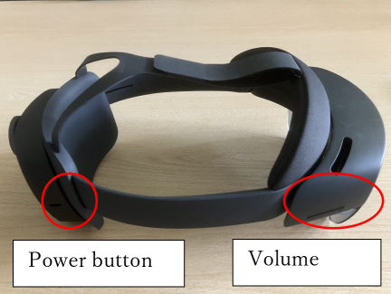
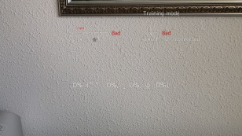
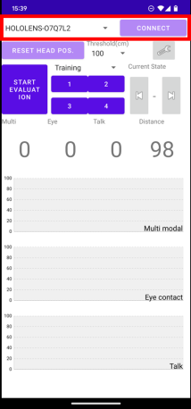
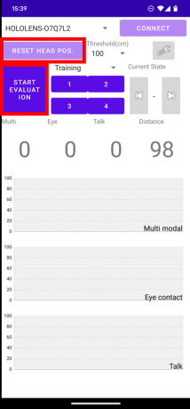
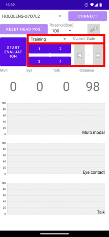
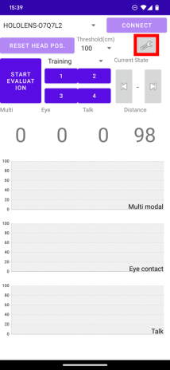
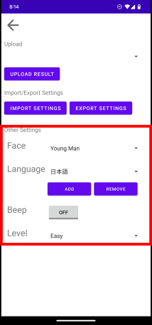
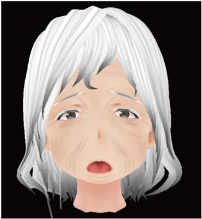

# HEARTS 4 Manual

Kyushu University

Ryo Kurazume

kurazume@ait.kyushu-u.ac.jp

## HumanitudE AR Training System "HEARTS"

HEARTS is a training system for dementia caregivers using AR technology and a real object for the gentle and effective caregiving technique "Humanitude".

HEARTS provides interaction between a caregiver and a patient during care by overlaying the patient's face on a doll using an AR device such as HoloLens 2 or NrealLight.

## Hardware

HEARTS 4 runs on HoloLens 2 and NrealLight.

Android smartphone can be used as a remote controller.

HoloLens 2 (Required)

Android smartphone (Optional) 

NrealLight (Optional)

## HoloLens application

### How to start “Humanitude anime” application.
1.	Push power button and wear HoloLens 2.

2.	Tap your wrist by index finger.

3.	Menu appears.

4.	Find “Humanitude anime” icon and tap it.

If you cannot find the icon, tap the list icon on the right and scroll down the list.

5.	Start “Humanitude anime” application.

### How to use “HEARTS” application.
1.	Place the avatar's face on the doll's face or other appropriate positions.

Say “Reset”.
 

Move the avatar’s face to the proper position.

Then, say “Reset” again.

You can use the smartphone application (explained later).

2.	How to start/stop the evaluation.

Say “Evaluation”. The scores will be changed.
 

Multimodal sore = Time at least two modalities are used / Total time * 100 

Eye contact sore = Time to detect eye contact / Total time * 100 

Voice sore = Time to detect voice / Total time * 100 

Touch sore = Time to detect touch / Total time * 100 

Level: Easy, Medium, Hard

Eye contact, Voice: Good or Bad

Distance: ★(>140cm), ★★(70~140cm), ★★★(<70cm)

Touch: “Not connected”, “No contact”, “Good”, “Too strong”, “Touch shoulders or back” (Scenario mode only) 

### How to shutdown “Humanitude anime”application.
1.	Tap your wrist by index finger.

2.	Tap the Home icon on the bottom of the menu.

3.	Blank window appears.

4.	Press × on the upper-right corner to close the application.

5.	The application shutdowns.

6.	Shutdown HoloLens 2.

## Smartphone application

### Download and install the smartphone application.

Permission may be required to install it from google drive.

https://drive.google.com/file/d/1mxolErebUfbyi4HmqSdmMvHaNNVckyc5/view?usp=share_link
 
The smartphone should be connected to HoloLens 2 via Bluetooth previously.

### How to use the smartphone application.
1.	Press “ARSocket” icon.

2.	Choose your HoloLens 2, and press “CONNECT” button.

If your HoloLens 2 is not found, check Bluetooth connection.

3.	Press “RESET HEAD POS.” or “START EVALUATION” buttons.

4.	Select the mode from Training or Scenario.

Training mode: Free training and skill evaluation.

Scenario mode: Training according to four scenarios.

5. The application settings can be changed from the setting page. 

Face		Young Man/Young Lady/Old Man/ Old Lady/Real Old Lady

Language	日本語/English

Beep		On/Off

Level		Easy/Medium/Hard

## Flow chart

## Facial expression

|  No communication (Fear/Sadness)  |  Voice (Normal)  | Eye contact (Smile)  |
| ---- | ---- |---- |
|  |  |  |

|  Sudden or strong touch (Surprise/Anger)| Gentle touch (Smile) |
|---- |---- |
|  | |

|  Smile  |  Anger  | Surprise  | Sadness | Fear |
| ---- | ---- |---- |---- |---- |
|  |  |  |  |  |
